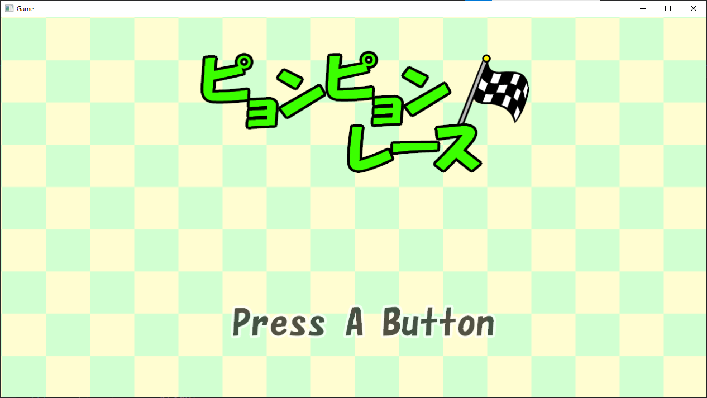
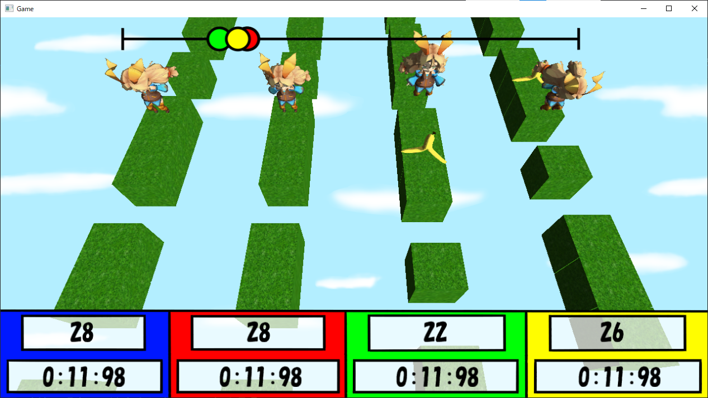
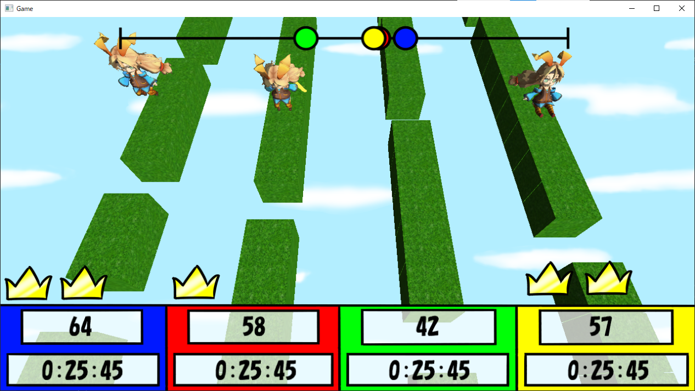
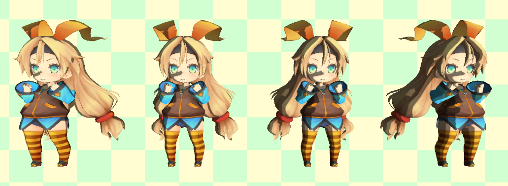

# 「ピョンピョンレース」作品説明資料
河原電子ビジネス専門学校　ゲームクリエイター科２年  
氏名：塚野博士  
 

---
# 目次
* [目次](#目次)
* [1. 作品概要](#1-作品概要)
* [2. 担当箇所](#2-担当箇所)
    * [2.1. 担当したソースコード](#21-担当したソースコード)
    * [2.2. 担当した仕様](#22-担当した仕様)
* [3. 改造したエンジンコード](#3-改造したエンジンコード)
* [4. ゲーム内容](#4-ゲーム内容)
    * [4.1 レースモード](#41-レースモード)
    * [4.2 サドンデスモード](#42-サドンデスモード)
* [5. 操作説明](#5-操作説明)
* [6. 技術紹介](#6-技術紹介)
    * [6.1. トゥーンシェーディング](#61-トゥーンシェーディング)
* [7. ゲーム的にこだわったところ](#7-ゲーム的にこだわったところ)
    * [7.1. データの読み込み](#71-データの読み込み)
    * [7.2. ステージの移動処理](#72-ステージの移動処理)
    * [7.3. ステージのランダム生成](#73-ステージのランダム生成)
    * [7.4. 選択画面の背景](#74-選択画面の背景)
---
# 1. 作品概要
* タイトル  
ピョンピョンレース
* 学校  
河原電子ビジネス専門学校
* 制作人数  
３人
* 制作期間  
2021年6月〜2021年8月
* ゲームジャンル  
レースゲーム
* プレイ人数  
１人〜４人
* 対応ハード  
PC Windows10
* 対応コントローラー  
キーボード、ゲームパッド
* 使用言語  
C++、HLSL
* 開発環境
    * エンジン  
    tkEngineMini（学校内製の簡易エンジン）  
    URL https://github.com/KawaharaKiyohara/tkEngineMini
    * プログラム  
    Visual Studio 2019
    * 3Dモデル、アニメーション  
    3ds MAX
    * 画像  
    FireAlpaca
    * バージョン管理  
    GitHub
    * タスク管理  
    Redmine
    * 連絡手段  
    Slack
* GitHub  
URL https://github.com/kbc23/SchoolFestivalGame
* 備考

---
# 2. 担当箇所
## 2.1. 担当したソースコード
* cppファイル、hファイル
    * main.cpp（一部）
    * main_processing.cpp、main_processing.h  
    ゲーム全体の処理の流れを管理
    * game_camera.cpp、game_camera.h  
    カメラの位置を管理
    * title.cpp、title.h  
    タイトルシーンの処理を管理
    * mode_select.cpp、mode_select.h  
    モードを選択処理の管理
    * player_select.cpp、player_select.h  
    プレイヤー人数を選択する処理の管理
    * CPU_strength_select.cpp、CPU_strength_select.h  
    CPUの強さを選択する処理の管理
    * game.cpp、game.h  
    ゲームシーンの処理を管理
    * player.cpp、player.h  
    プレイヤーの処理を管理
    * stage.cpp、stage.h  
    ステージの処理を管理
    * score.cpp、score.h  
    プレイヤーのプレイ時間を管理
    * rank.cpp、rank.h
    プレイヤーの順位、取得ラウンド数を管理
    * game_start_countdown.cpp、game_start_countdown.h  
    ゲームスタート時のカウントダウンの管理
    * effect_render.cpp、effect_render.h  
    エフェクトの処理
    * font_render.cpp、font_render.h  
    フォントの処理
    * model_render.cpp、model_render.h  
    モデルの処理
    * sound_BGM.cpp、sound_BGM.h  
    BGMの処理
    * sound_SE.cpp、sound_SE.h  
    SEの処理
    * sprite_render.cpp、sprite_render.h  
    スプライトの処理
    * fade.cpp、fade.h  
    フェードの処理

---
## 2.2. 担当した仕様
* タイトルシーン
* モード選択シーン
* プレイヤー人数選択シーン
* CPUの強さ選択シーン
* ゲームシーンの一部
    * プレイヤー
    * ステージ
    * スコア（プレイヤーのタイム）
    * ゲーム開始時のカウントダウン

---
# 3. 改造したエンジンコード
* cppファイル、hファイル
    * Material.cpp  
    30〜38行、80行
    * Material.h  
    43〜50行、111行、115行
    * MeshParts.cpp  
    71、72行
    * NullTextureMaps.cpp  
    41〜46行
    * NullTextureMaps.h  
    41〜56行、125、126行
    * TkmFile.h
    30、31行
* fxファイル
    * model.fx

---
# 4. ゲーム内容
## 4.1 レースモード
２マスジャンプ、１マスジャンプを駆使し、障害物を避けながらいち早くゴールを目指すレースゲーム。

・「ゲーム画面の画像」

---
## 4.2 サドンデスモード
ミスをしたら、そのラウンドの間は参加できない３ラウンド先取のモード。  
取得したラウンド数に応じて、順位が決定する。
* ラウンド取得の条件
    * 最初にゴールに到着する
    * 自分以外のプレイヤーが全員ミスをする
    * ２位のプレイヤーから２０ブロック以上先のブロックに到達する

・「ゲーム画面の画像」

---
# 5. 操作説明
## キーボード
* 選択画面（後で対応キーを変更）
    * Zキー：決定
    * Xキー：キャンセル
    * 十字キー：カーソル移動
* ゲーム画面
    * Zキー：２マスジャンプ
    * Xキー：１マスジャンプ
    * ESCAPEキー：ポーズ画面を開く、閉じる
## ゲームパッド
* 選択画面
    * Aボタン：決定
    * Bボタン：キャンセル
    * 十字キー：カーソル移動
* ゲーム画面
    * Aボタン：２マスジャンプ
    * Bボタン：１マスジャンプ
    * STARTボタン：ポーズ画面を開く、閉じる

---
# 6. 技術紹介
## 6.1. トゥーンシェーディング
このゲームでは、アニメ調の描画処理であるトゥーンシェーディングを使用している。

### ・処理の流れ
1. トゥーンシェーディングで使用するテクスチャを読み込む。  
・「トゥーンシェーディングで使用する画像」
  
 
2. ハーフランバート拡散照明によるライティング計算をおこなう。  
 
3. 計算したライティングの結果の値を、UV座標のX成分としてトゥーンシェーディングで使用する画像から色を取得して、モデルに反映する。  
・「トゥーンシェーディングの結果が反映されたキャラクターモデル」

---
# 7. ゲーム的にこだわったところ
## 7.1. データの読み込み
モデルなどの読み込みには時間がかかる。  
そのため、このゲームではゲーム起動時にモデルなどのデータをすべて読み込み、  
その後、表示、非表示を使用してゲームの処理をおこなっていく。  
※このゲームで読み込む必要があるものが少ないため、この手法をとっている。
### ・使用する関数、変数
* void Init()  
そのクラスで処理を始めるときに呼ぶ初期化関数。  
表示する必要があるものの表示をしたり、メンバ変数の値の初期化をおこなう。  
 
* void Finish()
そのクラスでの処理をしなくなるときに呼ぶ関数。  
そのクラスで使用しているものを非表示にする処理などをおこなっている。  
 
* bool m_flagProcess  
そのクラスで処理をおこなうかを管理するフラグ。   
・true : そのクラスの処理をおこなう  
・false : そのクラスで処理をおこなわない  
Init()関数でtrueに、Finish()関数でfalseにする。  
そのクラスのUpdate()関数という毎フレーム処理をおこなう関数の最初に  
m_flagProcessがfalseのときにreturnする処理があり、そこでそのクラスが毎フレームの処理をするかを管理している。  
 

### ・処理の流れ
1. ゲーム起動時、ゲームで使用するモデル、スプライト、サウンドなどをすべて読み込む。
2. 使用しないものをすべて非表示にする。
3. クラスを使用するときにInit()関数を呼び、オブジェクトの表示やメンバ変数の値の初期化をおこなう。
4. そのクラスの処理をおこなう
5. クラスを使用しなくなったとき、Finish()関数を呼び、オブジェクトの非表示をおこなう。
6. ゲーム終了時、ゲームで使用していたオブジェクトの削除をおこなう。
---
## 7.2. ステージの移動処理
このゲームは、プレイヤーがステージをジャンプで進んでいくレースゲームだが、移動する際に動くモデルは、プレイヤーのモデルではなくステージのモデルである。  
ステージを手前に移動するデザインだが、ステージが奥に移動することによって、プレイヤーが手前に移動しているように見せている。  
※プレイヤーのモデルは、ジャンプアニメーション時に上下には移動する。

---
## 7.3. ステージのランダム生成
ステージを作る際、ランダムで作成されるようになっている。
そのため、プレイするためにステージの形が変わるようになっている。

### ・ブロックの種類
* 緑ブロック：なにもおきない普通のブロック
* 穴ブロック：このブロックに止まると、一定時間操作不能になった後、前にいたブロックの位置に戻される。
* バナナブロック：このブロックに止まると、一定時間操作不能になる。その後、緑ブロックに変化する。

### ・ステージ作成のルール
* 緑ブロックは連続で６個まで生成される。
* 連続で緑ブロックが生成される確率は、連続で生成されるほど低くなる。
* 緑ブロックではないとき、穴ブロックかバナナブロックが生成される。
* 穴ブロックかバナナブロックが生成されるとき、70%で穴ブロック、30%でバナナブロックが生成される。
* 穴ブロックかバナナブロックが生成されたとき、その次のブロックは確定で緑ブロックが生成される。
* 100個目のブロックは、確定でゴールブロックになる。

---
## 7.4. 選択画面の背景
選択画面の背景は、チェック柄の画像が左上に移動するものになっている。

### ・処理の内容
* 使用画像
    * Background.dds
    * Background_2.dds  
    Background.ddsを左右反転させた画像  
    ※画像のサイズは、ゲームスクリーンと同じサイズ  
     
* 画像の初期配置  
1 : Background.dds、2 : Background_2.ddsとすると、 
    
1 1  
2 2 2  
&nbsp;&nbsp; 1 1  
 
となっている。  
（左上の1がゲームスクリーンの位置）    
 
* 画像のアニメーション  
全体を左上に移動させて、右下の1が左上のゲームスクリーンの位置に移動したら、すべての画像を最初の位置に戻す。